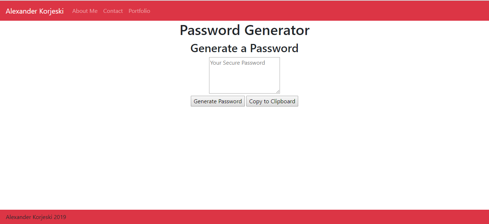

# randompassword
This is a repo that will hold my Random Password Generator.

This Random Password generator will create a password for the user and display it in both the console and HTML.

The user is prompted to enter a password length between 8 and 128 character and to choose a type of password: numbers, lower case letter or upper case letter.

When the user clicks the "Generate Password" button, the randomly generated password is populated inside the text box and on the back end (console).

The user can also utilize the "Copy to Clipboard" button so that they can easily paste this new password into the appropriate field(s).

